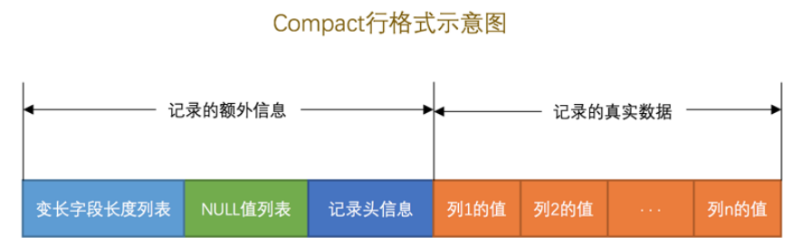
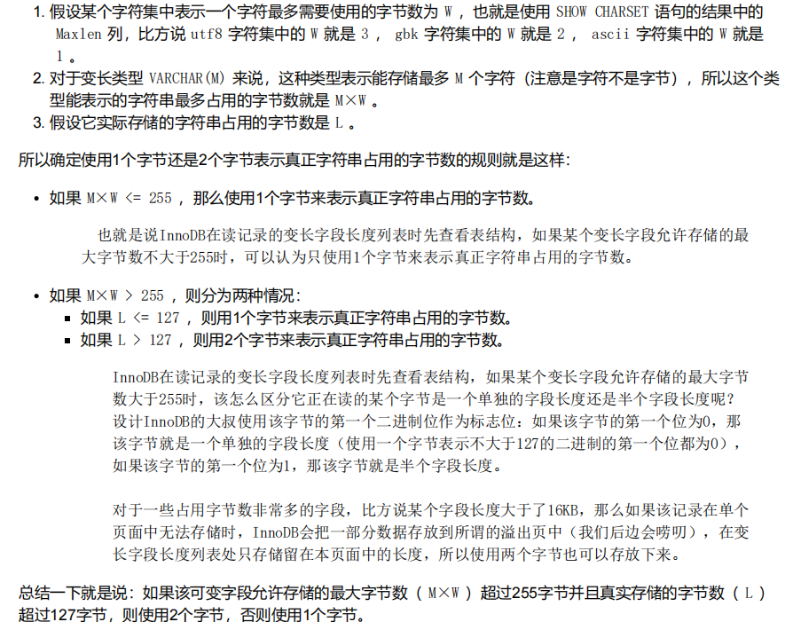
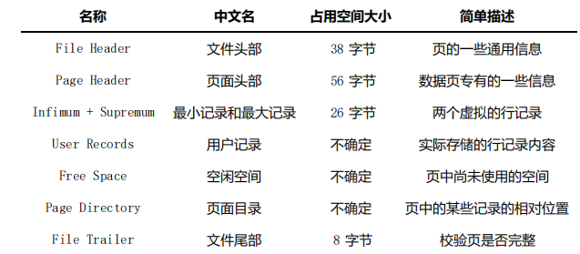
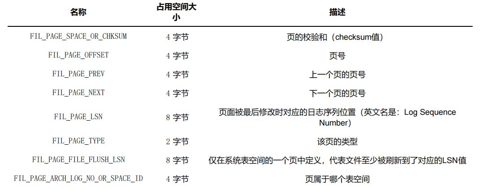
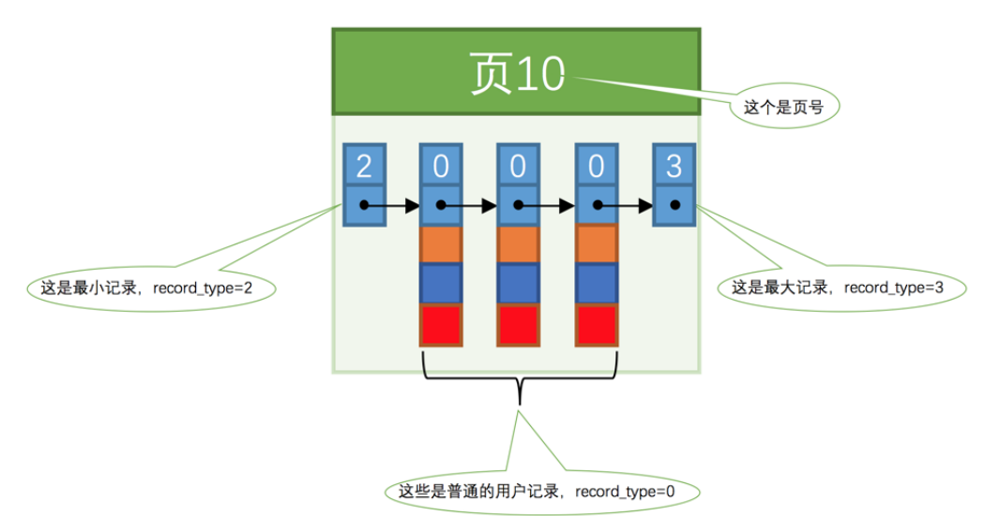
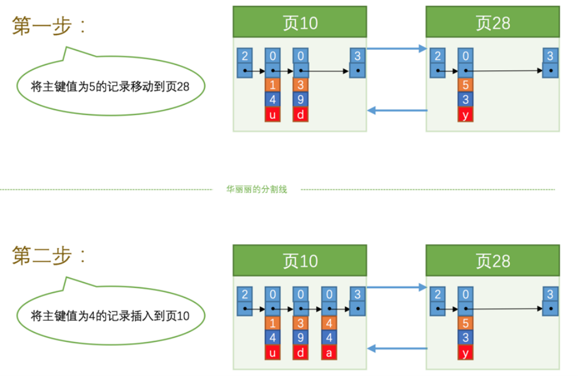
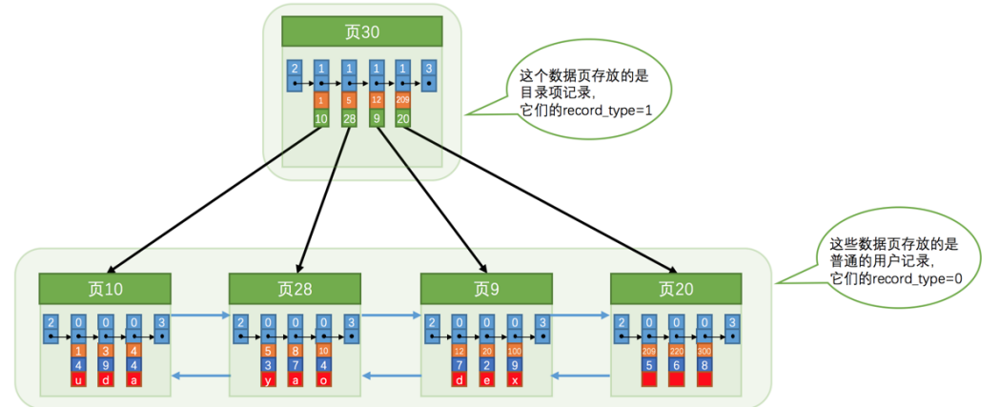
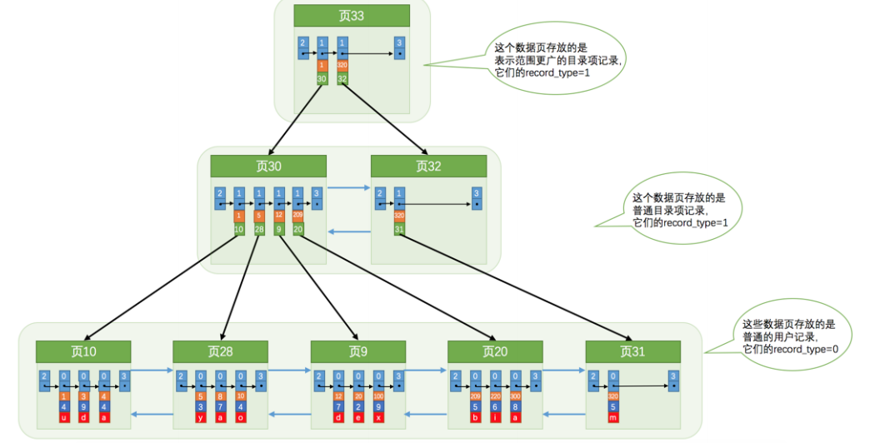
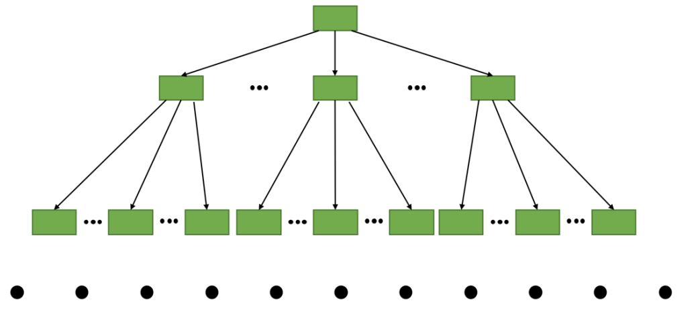

# MySQL运行原理

## 一、基础

### 1.1 客户端与服务器连接的过程

#### TCP/IP

MySQL 采用 TCP 作为服务器和客户端之间的网络通信协议。在网络环境下，每台计算机都有一个唯一的 IP地址，如果某个进程有需要采用 TCP 协议进行网络通信方面的需求，可以向操作系统申请一个 端口号 ，这是一个整数值，它的取值范围是 0~65535 。这样在网络中的其他进程就可以通过 IP地址 + 端口号 的方式来与这个进程连接，这样进程之间就可以通过网络进行通信了。

#### 命名管道和共享内存

如果是 Windows 用户，那么客户端进程和服务器进程之间可以考虑使用 命名管道或共享内存 进行通信

#### Unix域套接字文件

### 1.2 服务器处理客户客户端请求

#### 连接管理

TCP/IP 、 命名管道或共享内存 、 Unix域套接字 这几种方式之一。

#### 解析与优化

##### 查询缓存

如果两个查询请求在任何字符上的不同（例如：空格、注释、大小写），都会导致缓存不会命中。如果查询请求中包含某些系统函数、用户自定义变量和函数、一些系统表，如mysql information_schemaperformance_schema 数据库中的表，那这个请求就不会被缓存。

MySQL的缓存系统会监测涉及到的每张表，只要该表的结构或者数据被修改，如对该表使用了 INSERT 、UPDATE 、 DELETE 、 TRUNCATE TABLE 、 ALTER TABLE 、 DROP TABLE 或DROP DATABASE 语句，那使用该表的所有高速缓存查询都将变为无效并从高速缓存中删除！

##### 语法解析

本质上是一个编译过程。

##### 查询优化

优化效率。

#### 存储引擎

调用存储引擎API，负责对表中数据的读取和写入工作。

### 1.3 存储引擎

#### 常用存储引擎

InnoDB和MyISAM

## 二、字符集和比较规则

### 2.1 简介

#### 字符集

**编码**：将一个字符映射成一个二进制数据的过程

**解码**：将一个二进制数据映射到一个字符的过程

**utf8mb4**是真正的ut8，包含表情文字等，应当显式指明使用。

#### Unicode和UTF-8的区别

Unicode全称是通用多八位字符集，统一了所有字符的编码，是一个字符集，但没有规定如何存储。例如一个编号为65的字符只需要一个字节就能存下，而编号靠后的字符需要多个字节，于是用什么规则存储Unicode字符成了关键。

MySQL中并不区分字符集和编码方案的概念。

### 2.2 应用

#### 各级别的字符集和比较规则

- 服务器级别
- 数据库级别
- 表级别
- 列级别

默认使用高一级别的字符集

## 三、InnoDB记录结构

### 3.1 简介

InnoDB是一个将表中的数据存储到磁盘上的存储引擎。

读取方式：将数据划分为若干个页，以页作为磁盘和内存之间交互的基本单位，InnoDB中页的大小一般为 **16** KB。

### 3.2 InnoDB行格式

#### 3.2.1 COMPACT 行格式

##### 3.2.1.1 记录的额外信息

- **变长字段长度列表**：如果内容占用的字节数比较小，用1个字节就可以表示，但是如果变长列的内容占用的字节数比较多，可能就需要用2个字节来表示，具体用1个还是2个字节来表示真实数据占用的字节数。如果采用变长字符集如utf8，那么该列也是变长列，长度会被存储到变长字段长度列表中。

- **NULL值列表：**记录允许为NULL值的列有哪些

- **记录头信息：**描述记录

##### 3.2.1.2 记录的真实数据

优先使用用户自定义主键作为主键，如果用户没有定义主键，则选取一个 Unique 键作为主键，如果表中连 Unique 键都没有定义的话，则 InnoDB 会为表默认添加一个名为row_id 的隐藏列作为主键。

InnoDB存储引擎会为每条记录都添加 **transaction_id**和 **roll_pointer** 这两个列，但是 **row_id** 是可选的（在没有自定义主键以及Unique键的情况下才会添加该列）。这些隐藏列的值不用我们操心， InnoDB 存储引擎会自己帮我们生成的。

#### 3.2.2 Redundant行格式

MySQL5.0之前使用的行格式

#### 3.2.3 行溢出数据

##### 3.2.3.1 VARCHAR最多能存储的数据

一定要记住一个行中的所有列（不包括隐藏列和记录头信息）占用的字节长度加起来不能超过65535个字节

##### 3.2.3.2 记录中数据太多导致的溢出

存储字节大于一页(16KB)，则记录的真实数据中用20个字节存储指向数据分散存储的其余页的地址

##### 3.2.3.3 行溢出的临界点

一页中至少存放两行记录

#### 3.2.4 Dynamic和Compressed行格式

这俩行格式和 Compact 行格式挺像，只不过在处理 行溢出 数据时有点儿分歧，它们不会在记录的真实数据处存储字段真实数据的前 768 个字节，而是把所有的字节都存储到其他页面中，只在记录的真实数据处存储其他页面的地址，就像这样：

Compressed 行格式和 Dynamic 不同的一点是， Compressed 行格式会采用压缩算法对页面进行压缩，以节省空间。

## 四、InnoDB数据页结构

### 4.1 不同类型的页

索引页：存放记录的页

### 4.2 数据页结构

### 4.3 记录在页中的存储

#### 4.3.1 记录头信息

被删除的记录之所以不立即从磁盘上移除，是因为移除它们之后把其他的记录在磁盘上重新排列需要性能消耗，所以只是打一个删除标记而已，所有被删除掉的记录都会组成一个所谓的 **垃圾链表** ，在这个链表中的记录占用的空间称之为所谓的 **可重用空间** ，之后如果有新记录插入到表中的话，可能把这些被删除的记录占用的存储空间覆盖掉。使用next_record复用原来被删除记录的存储空间

next_record:表示从当前记录的真实数据到下一条记录的真实数据的地址偏移量。规定最小记录的下一条记录就是本页中主键值最小的用户记录，而本页中主键值最大的用户记录的下一条记录就是最大记录。因此记录形成了一个**单链表**。

### 4.4 页目录

将所有记录（不包括被标记为已删除的记录）划分为几个组。

将每个组的最后一条记录的地址偏移量单独提取出来按顺序存储到靠近 页 的尾部的地方，这个地方就是所谓的 Page Directory ，也就是 页目录

对于最小记录所在的分组只能有 **1** 条记录，最大记录所在的分组拥有的记录条数只能在 **1~8** 条之间，剩下的分组中记录的条数范围只能在是 **4~8** 条之间。

所以在一个数据页中**查找指定主键值的记录的过程**分为两步：

1. 通过**二分**法确定该记录所在的槽，并找到该槽中主键值最小的那条记录。
2. 通过记录的 next_record 属性遍历该槽所在的组中的各个记录。

### 4.5 页面头部

针对数据页，存储各种状态信息

### 4.6 文件头部

针对各种页通用的信息

- FIL_PAGE_PREV 和 FIL_PAGE_NEXT

通过建立一个双向链表把许许多多的页就都串联起来了，而无需这些页在物理上真正连着。需要注意的是，并不是所有类型的页都有上一个和下一个页的属性。数据页实际上是一个**双向链表**。

### 4.7 文件尾部

用于检测一个页是否完整整（也就是在同步的时候有没有发生只同步一半的尴尬情况）

## 五、B+树索引

各个数据页可以组成一个 **双向链表** ，而每个数据页中的记录会按照主键值从小到大的顺序组成一个 **单向链表** ，每个数据页都会为存储在它里边儿的记录生成一个页目录 ，在通过主键查找某条记录的时候可以在 页目录 中使用**二分法**快速定位到对应的槽，然后再**遍历该槽**对应分组中的记录即可快速找到指定的记录

### 5.1 没有索引的查找

#### 5.1.1 在一个页中的查找

- 以主键为搜索条件

  页目录中二分法找到对应的槽，然后遍历该槽

- 以其它列为搜索条件

  只能从最小记录开始依次遍历单链表中的每条记录，效率低

#### 5.1.2 在很多页中查找

索引

### 5.2 索引

#### 5.2.1 简单的索引方案

新分配的数据页编号可能并不是连续的，也就是说我们使用的这些页在存储空间里可能并不挨着。它们只是通过维护着上一个页和下一个页的编号而建立了链表关系。

插入记录的过程（要求下一个数据页中用户记录的主键值必须大于上一个页中用户记录的主键值）

因为这些 16KB 的页在物理存储上可能并不挨着，所以如果想从这么多页中根据主键值快速定位某些记录所在的页，我们需要给它们做个目录，每个页对应一个目录项，每个目录项包括下边两个部分：

- 页的用户记录中最小的主键值，我们用 key 来表示。
- 页号，我们用 page_no 表示。

以实现根据主键值快速查找某条记录的功能，具体查找过程分两步：

- 先从目录项中根据二分法快速确定出主键值为 20 的记录在 目录项3 中（因为 12 < 20 < 209 ），它对

  应的页是 页9 。

- 再根据前边说的在页中查找记录的方式去 页9 中定位具体的记录。

#### 5.2.2 InnoDB中的索引方案

复用了之前存储用户记录的数据页来存储目录项，为了和用户记录做一下区分，我们把这些用来表示目录项的记录称为 目录项记录。即新分配一个页来专门存储目录页记录。

InnoDB 怎么区分一条记录是普通的 用户记录 还是 目录项记录 呢？利用记录头信息里的record_type 属性，它的各个取值代表的意思如下：

- 0 ：普通的用户记录
- 1 ：目录项记录
- 2 ：最小记录
- 3 ：最大记录

目录项记录和普通的 用户记录 的不同点：

- 目录项记录 的 record_type 值是1，而普通用户记录的 record_type 值是0。
- 目录项记录 只有主键值和页的编号两个列，而普通的用户记录的列是用户自己定义的，可能包含很多列，另外还有 InnoDB 自己添加的隐藏列。
- 还记得我们之前在唠叨记录头信息的时候说过一个叫 min_rec_mask 的属性么，只有在存储 目录项记录 的页中的主键值最小的 目录项记录 的 min_rec_mask 值为 1 ，其他别的记录的 min_rec_mask 值都是 0 。

根据某个主键值去查找记录的步骤就可以大致拆分成下边两步：

1. 先到存储 目录项记录 的页，也就是页 30 中通过二分法快速定位到对应目录项，因为 12 < 20 < 209 ，所以定位到对应的记录所在的页就是 页9 。

2. 再到存储用户记录的 页9 中根据二分法快速定位到主键值为 20 的用户记录。

当表中的数据非常多则会产生很多存储 目录项记录 的页，为这些存储 目录项记录 的页再生成一个更高级的目录，就像是一个多级目录一样，大目录里嵌套小目录，小目录里才是实际的数据，所以现在各个页的示意图就是这样子：

随着表中记录的增加，这个目录的层级会继续增加，如果简化一下，那么我们可以用下边这个图来描述它：

不论是存放用户记录的数据页，还是存放目录项记录的数据页，我们都把它们存放到 B+ 树这个数据结构中了。**实际用户记录其实都存放在B+树的最底层的节点上**

##### 5.2.2.1 聚簇索引

1. 使用记录主键值的大小进行记录和页的排序，这包括三个方面的含义：

- 页内的记录是按照主键的大小顺序排成一个单向链表。
- 各个存放用户记录的页也是根据页中用户记录的主键大小顺序排成一个双向链表。
- 存放目录项记录的页分为不同的层次，在同一层次中的页也是根据页中目录项记录的主键大小顺序排成一个双向链表。

2. B+ 树的叶子节点存储的是完整的用户记录。

InnoDB 存储引擎会自动的为我们创建聚簇索引。另外有趣的一点是，在 InnoDB 存储引擎中， 聚簇索引 就是数据的存储方式（所有的用户记录都存储在了 叶子节点 ），也就是所谓的**索引即数据，数据即索引**。

##### 5.2.2.2 二级索引

以别的列作为搜索条件，多建几棵 B+ 树，不同的 B+ 树中的数据采用不同的排序规则。与聚簇索引不同如下：

- B+ 树的叶子节点存储的并不是完整的用户记录，而只是 c2列+主键 这两个列的值。
- 目录项记录中不再是 主键+页号 的搭配，而变成了 c2列+页号 的搭配。

**必须再根据主键值去聚簇索引中再查找一遍完整的用户记录****

##### 5.2.2.2 联合索引

本质上也是个二级索引

- 每条 目录项记录 都由 c2 、 c3 、 页号 这三个部分组成，各条记录先按照 c2 列的值进行排序，如果记录的 c2 列相同，则按照 c3 列的值进行排序。
- B+ 树叶子节点处的用户记录由 c2 、 c3 和主键 c1 列组成。

#### 5.2.3 InnoDB 的B+树索引的注意事项

一个B+树索引的根节点自诞生之日起，便不会再移动。

如果目录项记录不唯一，会把 主键值 也添加到二级索引内节点中的目录项记录了。

### 5.2.4 MyISAM索引方案

插入数据时并没有可以按主键大小排序，索引信息另外存储到一个称为索引文件的另一个文件中。相当于MyISAM中建立的索引全部是二级索引。

## 六、B+树索引的使用

### 6.1 适用条件

#### 6.1.1 全值匹配

#### 6.1.2 匹配左边的列

因为B+树的数据页和记录先是按照左边的列的值排序的，在相同情况下才使用右边的列的值

#### 6.1.3 匹配列前缀

这些字符串的前n个字符，也就是前缀都是排好序的，所以对于字符串类型的索引列来说，我们只匹配它的前缀也是可以快速定位记录的，

#### 6.1.4 匹配范围值

如果对多个列同时进行范围查找的话，只有对索引最左边的那个列进行范围查找的时候才能用到 B+ 树索引

#### **6.1. 5 精确匹配某一列并范围匹配另外一列**

如果左边的列是精确查找，则右边的列可以进行范围查找

#### 6.1.6 用于排序

如果 ORDER BY 子句里使用到了我们的索引列，就有可能省去在内存或文件中排序的步骤

注意：

- 列的顺序也必须按照索引列的顺序给出
- 各个排序列的排序顺序是一致的，也就是要么各个列都是 ASC 规则排序，要么都是 DESC 规则排序。

#### 6.1.7 用于分组

分组列的顺序也需要和索引列的顺序一致

### 6.2 回表的代价

回表：索引不包含查询所需的全部列，那么即使索引帮助定位到了相关的记录位置，数据库引擎仍然需要回到实际的数据表中去读取完整的行数据

- 会使用到两个 B+ 树索引，一个二级索引，一个聚簇索引。
- 访问二级索引使用 顺序I/O ，访问聚簇索引使用 随机I/O 。

**需要回表的记录越多，使用二级索引的性能就越低，**

一般情况下，限制查询获取较少的记录数会让优化器更倾向于选择使用 二级索引 + 回表 的方式进行查询，因为回表的记录越少，性能提升就越高

#### 6.2.1 覆盖索引

为了彻底告别 回表 操作带来的性能损耗，我们建议：最好在查询列表里只包含索引列，得到结果后就不必到 聚簇索引 中再查找记录的剩余列

### 6.3 如何挑选索引

#### 6.3.1 **只为用于搜索、排序或分组的列创建索引**

只为出现在 WHERE 子句中的列、连接子句中的连接列，或者出现在 ORDER BY 或 GROUP BY 子句中的列创建索引。而出现在查询列表中的列就没必要建立索引了：

#### 6.3.2 考虑列的基数

不重复的值的数量越大，索引效果越好

#### 6.3.3 索引列的类型尽量小

#### 6.3.4 **索引字符串值的前缀**

只对字符串的前几个字符进行索引，既节约空间，又减少了字符串的比较时间，还大概能解决排序的问题

#### 6.3.5 **让索引列在比较表达式中单独出现**

1. WHERE my_col * 2 < 4
2. WHERE my_col < 4/2

第2个 WHERE 子句中 my_col 列并是以单独列的形式出现的，这样的情况可以直接使用B+ 树索引.

#### 6.3.6 **主键插入顺序**

建议：让主键具有 AUTO_INCREMENT ，让存储引擎自己为表生成主键，而不是我们手动插入，避免页面分裂和记录移位。

## 七、数据目录

### 7.1 数据目录的结构

#### 7.1.1 **数据库在文件系统中的表示**

#### 7.1.2 **表在文件系统中的表示**

InnoDB:系统表空间、独立表空间等。

MyISAM:表数据都存放到对应的数据库子目录下。

#### 7.1.3 **视图在文件系统中的表示**

存储 视图 的时候是不需要存储真实的数据的，只需要把它的结构存储起来就行了

## 八、InnoDB的表空间

