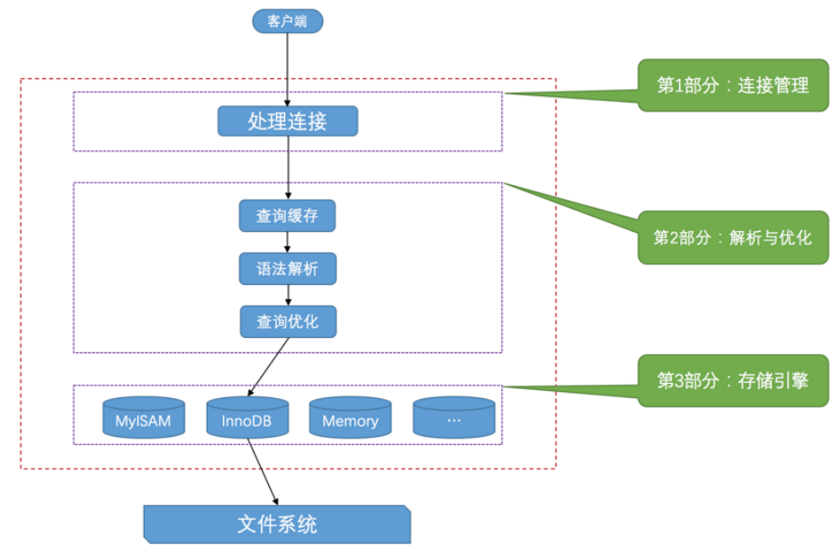

# MySQL运行原理

## 一、基础

### 1.1 客户端与服务器连接的过程

#### TCP/IP

MySQL 采用 TCP 作为服务器和客户端之间的网络通信协议。在网络环境下，每台计算机都有一个唯一的 IP地址，如果某个进程有需要采用 TCP 协议进行网络通信方面的需求，可以向操作系统申请一个 端口号 ，这是一个整数值，它的取值范围是 0~65535 。这样在网络中的其他进程就可以通过 IP地址 + 端口号 的方式来与这个进程连接，这样进程之间就可以通过网络进行通信了。

#### 命名管道和共享内存

如果是 Windows 用户，那么客户端进程和服务器进程之间可以考虑使用 命名管道或共享内存 进行通信

#### Unix域套接字文件

### 1.2 服务器处理客户客户端请求

#### 连接管理

TCP/IP 、 命名管道或共享内存 、 Unix域套接字 这几种方式之一。

#### 解析与优化

##### 查询缓存

如果两个查询请求在任何字符上的不同（例如：空格、注释、大小写），都会导致缓存不会命中。如果查询请求中包含某些系统函数、用户自定义变量和函数、一些系统表，如mysql information_schemaperformance_schema 数据库中的表，那这个请求就不会被缓存。

MySQL的缓存系统会监测涉及到的每张表，只要该表的结构或者数据被修改，如对该表使用了 INSERT 、UPDATE 、 DELETE 、 TRUNCATE TABLE 、 ALTER TABLE 、 DROP TABLE 或DROP DATABASE 语句，那使用该表的所有高速缓存查询都将变为无效并从高速缓存中删除！

##### 语法解析

本质上是一个编译过程。

##### 查询优化

优化效率。

#### 存储引擎

调用存储引擎API。

### 1.3 存储引擎

#### 常用存储引擎

InnoDB和MyISAM

## 二、字符集和比较规则

### 2.1 简介

#### 字符集

**编码**：将一个字符映射成一个二进制数据的过程

**解码**：将一个二进制数据映射到一个字符的过程

**utf8mb4**是真正的ut8，包含表情文字等，应当显式指明使用。

#### Unicode和UTF-8的区别

Unicode全称是通用多八位字符集，统一了所有字符的编码，是一个字符集，但没有规定如何存储。例如一个编号为65的字符只需要一个字节就能存下，而编号靠后的字符需要多个字节，于是用什么规则存储Unicode字符成了关键。

### 2.2 应用

#### 各级别的字符集和比较规则

- 服务器级别
- 数据库级别
- 表级别
- 列级别

